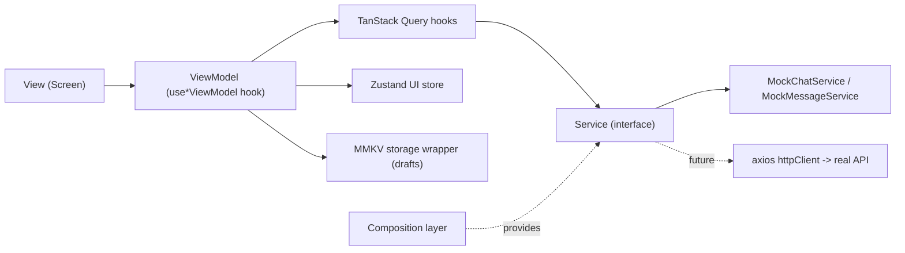

# Design / Architecture Spec

## 1. Tech Stack

| Concern              | Choice                                  |
|-----------------------|------------------------------------------|
| Framework             | React Native CLI (TypeScript template)   |
| Architecture pattern  | MVVM                                     |
| Client/UI state       | Zustand                                  |
| Server state / cache  | TanStack Query                           |
| HTTP client           | axios                                    |
| Local storage         | MMKV (`react-native-mmkv`)               |
| Navigation            | React Navigation (native stack)          |
| Dependency Injection  | Composition hooks (React Context + hooks)|

## 2. High-Level Data Flow



- **View** never talks to Query/Service/Store directly — only through its ViewModel.
- **ViewModel** orchestrates Query hooks, the Zustand UI store, and storage; contains all logic and exposes a flat `{ state..., intents... }` object to the View.
- **Service** implementations are swapped in one place (`src/composition/composition.ts`).

## 3. Folder Structure

```
src/
  models/            # ChatSummary, Message — plain types, no React
  services/
    http/            # axios instance
    storage/         # MMKV wrapper + draft helpers
    chat/            # ChatService interface + Mock implementation + mock data
    message/         # MessageService interface + Mock implementation + mock data
  composition/        # DI wiring (composition.ts) + ServiceProvider + useServices hooks
  data/
    queries/          # TanStack Query hooks (useChatsQuery, useMessagesQuery, mutations, queryKeys)
  store/               # Zustand stores (useChatUiStore)
  viewmodels/          # useChatListViewModel, useConversationViewModel
  navigation/          # RootNavigator, RootStackParamList
  screens/
    ChatListScreen/
    ConversationScreen/
  components/          # Avatar, ChatListItem, MessageBubble, StateViews
  theme/               # colors.ts
  utils/               # formatters.ts, id.ts
```

## 4. Screens

### ChatListScreen
- ViewModel: `useChatListViewModel(navigation)`
- Data: `useChatsQuery()` → `ChatService.getChats()`
- UI: `FlatList` + `ChatListItem` + pull-to-refresh + Loading/Error/Empty states.

### ConversationScreen
- Route params: `{ chatId, chatName }`
- ViewModel: `useConversationViewModel(chatId)`
- Data: `useMessagesQuery(chatId)`, `useSendMessageMutation(chatId)` (optimistic), `useMarkChatAsReadMutation()`
- Side effects: sets `activeChatId` in the Zustand UI store; persists composer draft via MMKV (`draftStorage`).
- UI: inverted `FlatList` of `MessageBubble` + composer (`TextInput` + send button).

## 5. Extensibility (what the user does next)

To connect a real backend:
1. Implement `ChatService`/`MessageService` using `httpClient` (e.g. `HttpChatService.ts`).
2. Swap the singletons in `src/composition/composition.ts`.
3. Nothing in `viewmodels/`, `screens/`, or `components/` needs to change.

## 6. Explicitly deferred (see [01-requirements.md](./01-requirements.md) section 1)

Auth, contacts, media, calls, groups, stories/status, push notifications, settings/profile, encryption.
